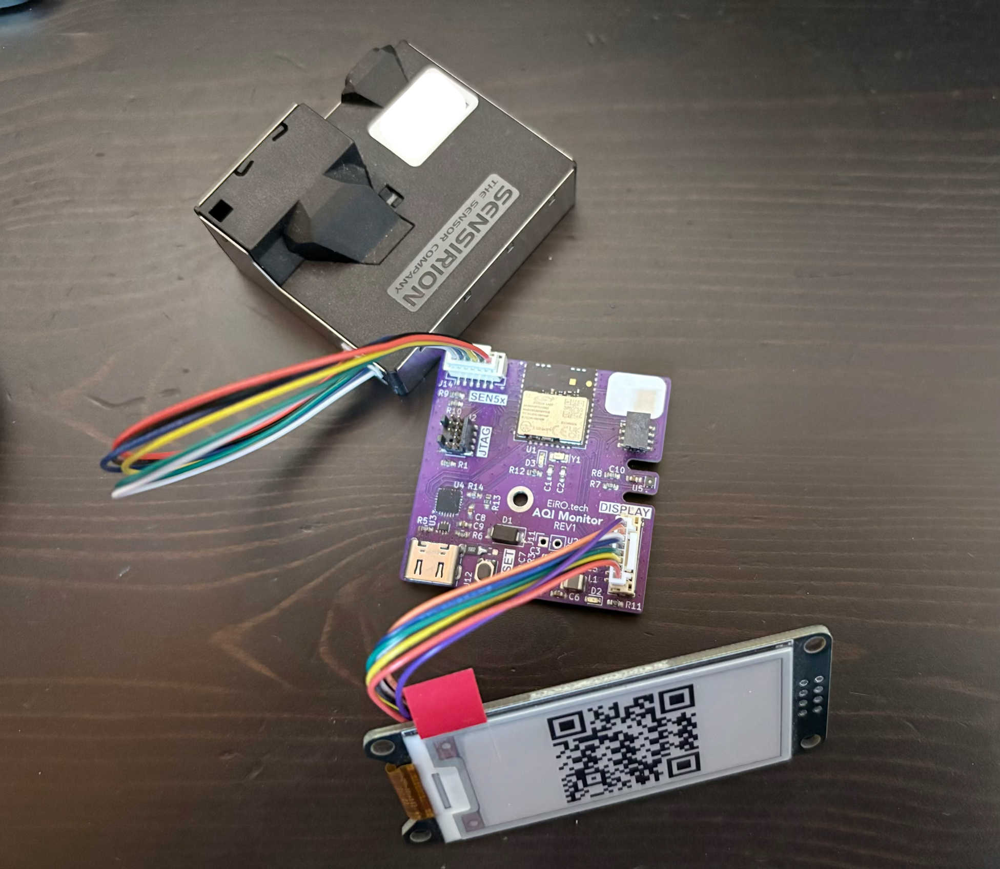
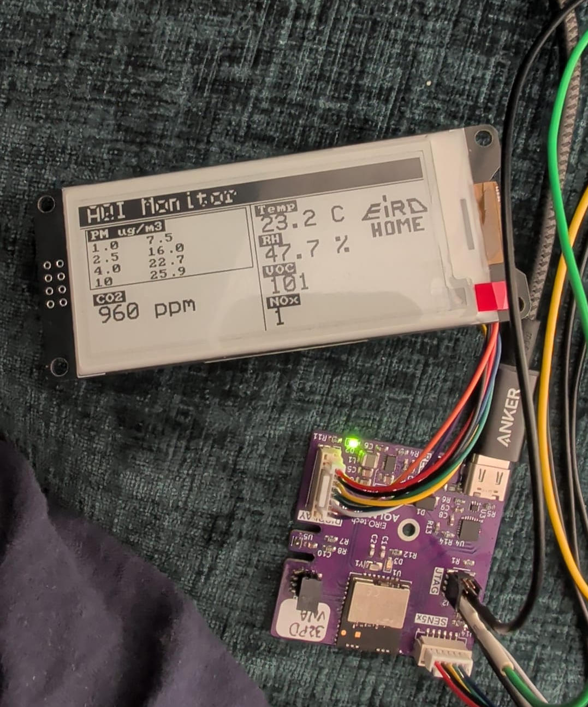

# AQI monitor

This project is a developement board based on a MGM260PD32VNA2 Module from SiliconLabs, SEN5x series sensors and with support for ePaper and other SPI based displays.
This board has been realized for the lack of available options that would satisfy our need in therms of a good air quality sensor. As for most commercial solutions are expensive, or they lack some features, such as Matter connectivity or some types of enviromental sensing. Most of the time they detect only PM2.5 and not PM10 and some do not include VOCs. 
Our targets of sensing values are the followings.
- Temperature
- Humidity
- PM 1.0, PM 2.5, PM 4, PM10
- VOC (index)
- CO2 
- NOx
- Formaldehyde 
- Overall AQI index (calculated)
  
Most of the sensing can be done using SEN55 and two addittional sensors for Formaldehyde and CO2. A SEN69C can also be used, but VCC on the connector is 5V and newer SEN6x are 3.3V powered, so the board has to be modified.

An advantage of using Matter as the default connectivity standard, is the ease of integrating it in any smart home (with also a Thread Border Router). There is no need for vendor specific applications, as all the data will be managed by Matter. This means there is no need for subscription and the device is completely local.

## Hardware Features

 - MGM260 SoM
   * BLE 5.4 Support 
   * Zigbee 3.0 and up
   * OpenThread
   * ARM Cortex M33 @ 80 MHz
   * 3.2MB Flash + 512kB RAM
   * Matrix Vector Processor for ML
 - SHT41 Temp. and Humidity Sensor
 - JTAG-SWD-9 connector
 - SPI expansion 4x2 1.27mm pitch
 - SPI connection for external display 
 - I2C expansion for external SEN5x series sensor node
 - USB-C for power and serial communication

## PICTURES

## LICENSE

Copyright Francesco Salmaso - EiRO.tech 2025-2026
This source describes Open Hardware and is licensed under the CERN-
OHL-S v2.
You may redistribute and modify this source and make products using it
under the terms of the CERN-OHL-S v2
(https://ohwr.org/cern ohl s v2.txt ).
This source is distributed WITHOUT ANY EXPRESS OR IMPLIED
WARRANTY, INCLUDING OF MERCHANTABILITY, SATISFACTORY
QUALITY AND FITNESS FOR A PARTICULAR PURPOSE. Please see
the CERN-OHL-S v2 for applicable conditions.
Source location: https://github.com/EiRO-Smart-Home/EiRO_AQI_Monitor_HW
As per CERN-OHL-S v2 section 4, should You produce hardware based
on this source, You must where practicable maintain the Source Location
visible on the external case of the EiRO AQI Monitor or other products you make using
this source.